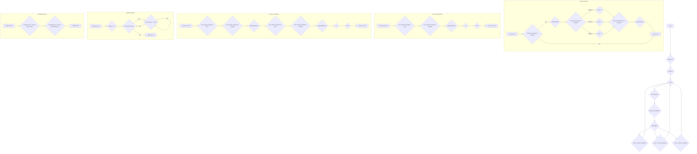

```mermaid
graph TD
    A[main] --> B{SystemInit};
    B --> C{GPIOInit};
    C --> D{Loop};
    D --> E{"choose(&type)"};
    E --> F{"showLoopLed(type)"};
    F --> G{"switch(type)"};
    G --> H{"case 0: mode_zero(1000);"};
    G --> I{"case 1: mode_one(1000);"};
    G --> J{"case 2: mode_zero(1000);"};
    H --> D;
    I --> D;
    J --> D;

    subgraph "choose function"
        E1[choose start] --> E2{Check if any button is pressed};
        E2 -- Yes --> E3{"myDelay(100)"};
        E3 --> E4{Check which button is pressed};
        E4 -- Button 3 --> E5{*type = 0};
        E4 -- Button 2 --> E6{*type = 1};
        E4 -- Button 1 --> E7{*type = 2};
        E5 --> E8{Wait until all buttons are released};
        E6 --> E8;
        E7 --> E8;
        E8 --> E9{"myDelay(100)"};
        E9 --> E10[choose end];
        E2 -- No --> E10;
    end

    subgraph "mode_zero function"
        H1[mode_zero start] --> H2{"LPC_GPIO0->FIOSET |= LED"};
        H2 --> H3{"LPC_GPIO0->FIOCLR |= loop1[i]"};
        H3 --> H4{"myDelay(ulTime)"};
        H4 --> H5{++i};
        H5 --> H6{i%=6};
        H6 --> H7[mode_zero end];
    end

    subgraph "mode_one function"
        I1[mode_one start] --> I2{"LPC_GPIO0->FIOSET |= LED"};
        I2 --> I3{"LPC_GPIO0->FIOCLR |= loop1[i]"};
        I3 --> I4{"myDelay(ulTime)"};
        I4 --> I5{"LPC_GPIO0->FIOCLR |= LED"};
        I5 --> I6{"LPC_GPIO0->FIOSET |= loop1[i]"};
        I6 --> I7{"myDelay(ulTime)"};
        I7 --> I8{++i};
        I8 --> I9{i%=6};
        I9 --> I10[mode_one end];
    end

    subgraph "myDelay function"
        K1[myDelay start] --> K2{Initialize i = 0};
        K2 --> K3{"Loop while ulTime--"};
        K3 -- Yes --> K4{Inner loop for i < 5000};
        K4 -- Yes --> K4;
        K4 -- No --> K3;
        K3 -- No --> K5[myDelay end];
    end

    subgraph "GPIOInit function"
        L1[GPIOInit start] --> L2{Configure P0.4 - P0.9 for LED control};
        L2 --> L3{Configure P0.1 - P0.3 for BUTTON input};
        L3 --> L4[GPIOInit end];
    end

```